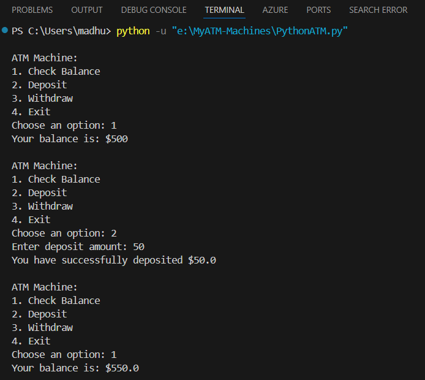
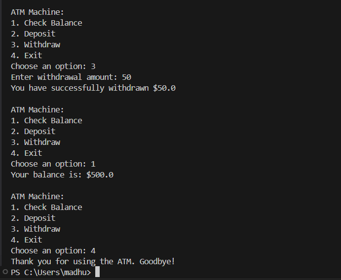

# MyATM Machines
## _Here is how it looks in all three languages i.e python , java , c++_

## Features

- Easy to implement
- Easy to understand

#### Prerequisites

- Visual Studio Code
- Basic extensions of python , java , c++

------------

**Free Software, Hell Yeah!**
